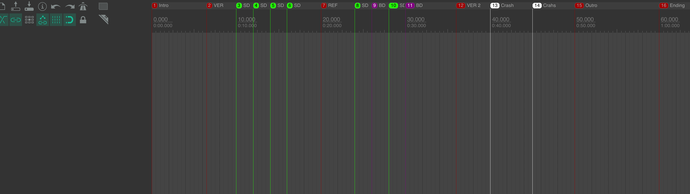
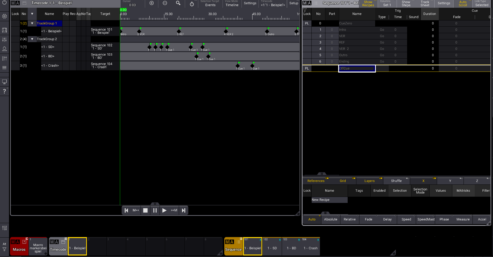

# 🎶 Reaper Markers to GrandMA3 💡

A web application for converting Reaper project markers to MA (Moving Light) timecode formats. This tool helps lighting professionals and audio engineers convert timing markers from Reaper DAW projects into formats suitable for lighting consoles and show control systems.

## Use the tool

🚀 **[Use Reaper2MA online](https://projects.hannesrueger.de/reaper2ma/)**

No installation or signup required - simply upload your Reaper project file and get your converted markers instantly for free.

## Demo

Check out the link above. You can create your own Reaper project or use [this demo file (click here to download)](./demo/demo.RPP).

## Features

-   Auto-Convert Reaper project markers to MA timecode
-   Support for repeated and unique sequences / cues
-   Web-based interface for easy access
-   No software installation required

| From this              | To this            |
| ---------------------- | ------------------ |
|  |  |

## Contributing

Contributions are welcome! If you'd like to contribute to this project:

1. Fork the repository
2. Create a feature branch (`git checkout -b feature/new-feature`)
3. Make your changes
4. Commit your changes (`git commit -am 'Add new feature'`)
5. Push to the branch (`git push origin feature/new-feature`)
6. Create a Pull Request

## Development

This project is built with SvelteKit. To run it locally:

```sh
# Install dependencies
pnpm install

# Start development server
pnpm dev
```

## License

MIT
